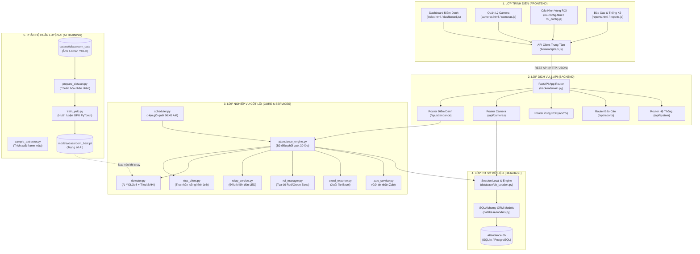

# BẢN THIẾT KẾ KIẾN TRÚC HỆ THỐNG & PHÂN CHIA VAI TRÒ DỰ ÁN
## HỆ THỐNG ĐIỂM DANH HỌC SINH TỰ ĐỘNG BẰNG AI CAMERA - THPT ĐIỀU CẢI

Tài liệu này định nghĩa cấu trúc phân tầng (Multi-tier Architecture) của dự án, quy ước giao tiếp giữa các phân hệ và hướng dẫn phân chia nhân sự để phát triển song song mà **không gây xung đột hay ảnh hưởng lẫn nhau**.

---

## 1. Sơ Đồ Kiến Trúc Tổng Thể

---

## 2. Bảng Phân Chia Vai Trò & Trách Nhiệm Từng Nhóm

| Vai Trò | Thư Mục Phụ Trách | Trách Nhiệm Chính | Lệnh Chạy Riêng |
|:---|:---|:---|:---|
| **Frontend Developer** | `frontend/` (`html`, `css`, `js`) | Thiết kế giao diện, vẽ đồ thị Chart.js, hiển thị bảng điểm danh, form camera, cấu hình canvas ROI. Gọi API qua `api.js`. | `run_frontend.bat` (Cổng 3000) |
| **Backend Developer** | `backend/`, `core/`, `services/`, `config/` | Xây dựng REST API, xử lý nghiệp vụ điểm danh, tích hợp Zalo/Excel/Relay, lập lịch tự động, viết test case. | `run_backend.bat` (Cổng 8000) |
| **Database Developer** | `database/` | Thiết kế cấu trúc bảng ORM (`models.py`), quản lý kết nối (`db_session.py`), nạp dữ liệu mẫu, backup dữ liệu. | `python -c "from database.db_session import init_db; init_db()"` |
| **AI Training Engineer** | `training/`, `dataset/`, `models/` | Chuẩn bị dữ liệu ảnh/nhãn, gán nhãn, fine-tuning mô hình YOLOv8 trên GPU NVIDIA RTX, đánh giá mAP/Loss. | `training\train_gpu.bat` |

---

## 3. Quy Ước Cộng Tác (Team Collaboration Rules)

1. **Giao tiếp Frontend - Backend qua Hợp Đồng API (API Contract):**
   - Frontend không truy cập trực tiếp vào CSDL hay thư mục mã nguồn Backend.
   - Toàn bộ dữ liệu được trao đổi qua JSON REST API (`http://localhost:8000/api/...`).
   - Frontend Developer tra cứu định dạng Request/Response tại Swagger UI: `http://localhost:8000/docs`.

2. **Huấn luyện AI độc lập không làm treo hệ thống:**
   - Kỹ sư AI thử nghiệm mô hình trong thư mục `training/`.
   - Quá trình huấn luyện sinh ra file kết quả trong `runs/` và không can thiệp vào các tiến trình Backend đang chạy.
   - Khi có mô hình mới tốt hơn, chỉ cần copy vào `models/classroom_best.pt`.

3. **Cơ chế Tương Thích Ngược 100% (Zero Breaking Change):**
   - Các lệnh chạy quen thuộc ở thư mục gốc (`app.py`, `run.bat`, `train_yolo.py`, `prepare_dataset.py`, `train_gpu.bat`) được giữ nguyên dưới dạng Chuyển tiếp (Proxy), không làm gãy bất kỳ tài liệu hay kịch bản tự động nào trước đây.
